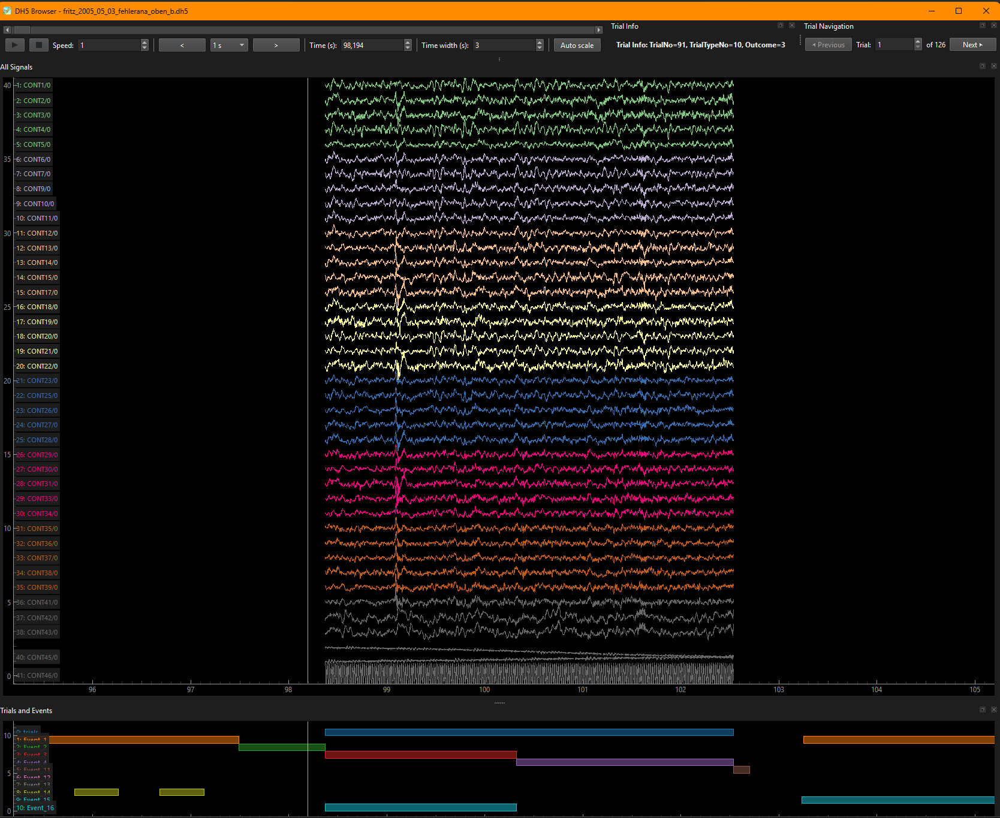

# Command-Line Tools

**dh5io** provides three command-line tools for working with DH5 files.

## dh5tree

Display the hierarchical structure of DH5 files in a tree format.

### Usage

```bash
dh5tree <filename.dh5>
```

### Example

```bash
dh5tree mydata.dh5
```

This will display the structure of the DH5 file, including:

- CONT groups (continuous analog signals)
- SPIKE groups (spike train data)
- Events
- Trial information

## dh5merge

Merge multiple DH5 files into a single output file.

### Usage

```bash
dh5merge <file1.dh5> <file2.dh5> [file3.dh5 ...] -o <output.dh5>
```

### Options

- `-o, --output` - Output file path (required)

### Example

```bash
dh5merge recording1.dh5 recording2.dh5 recording3.dh5 -o merged.dh5
```

## dh5browser

Interactive graphical browser for exploring DH5 files with trial navigation.



### Usage

```bash
# Open a DH5 file (displays first trial)
dh5browser <filename.dh5>

# Open a specific trial
dh5browser <filename.dh5> --trial <trial_number>

# Adjust cache size for faster navigation
dh5browser <filename.dh5> --cache-size <size>

# Enable debug mode to see cache performance
dh5browser <filename.dh5> --debug
```

### Options

- `--trial` - Start with a specific trial number (default: 0)
- `--cache-size` - Number of trials to cache for faster navigation (default: 10)
- `--debug` - Enable debug mode to display cache performance information

### Features

The browser provides an interactive interface for exploring DH5 files:

**Data Visualization:**

- **Analog signals** (CONT groups) - Multi-channel trace viewer
- **Spike trains** (SPIKE groups) - Raster plots
- **Events** (EV02) - Labeled vertical lines in synchronized viewer
- **Epochs** (TRIALMAP) - Trial markers

**Channel Selection:**

- Double-click on the trace viewer to open the parameters panel
- Show/hide individual channels by toggling their "visible" checkbox
- Adjust per-channel gain and offset and colors
- Persistent settings across sessions

### Requirements

The `dh5browser` tool requires the `[browser]` optional dependencies:

```bash
uv pip install dh5io[browser]
# or
pip install dh5io[browser]
```

### Example

```bash
# Open file and browse first trial
dh5browser mydata.dh5

# Open file at trial 5
dh5browser mydata.dh5 --trial 5

# Increase cache size for better performance
dh5browser mydata.dh5 --cache-size 20

# Debug mode to monitor cache hits/misses
dh5browser mydata.dh5 --debug
```

The browser is built on [ephyviewer](https://ephyviewer.readthedocs.io/) and provides an intuitive interface for exploring neurophysiology data.

## Installation

See the [Installation](installation.md#installing-cli-tools) page for details on installing these command-line tools using `uv tool` or other methods.
